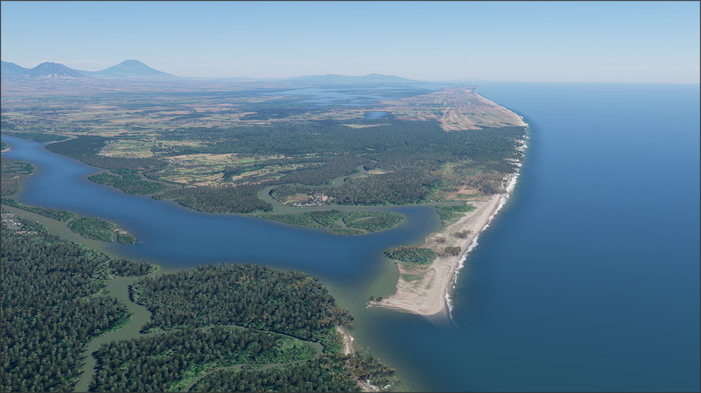
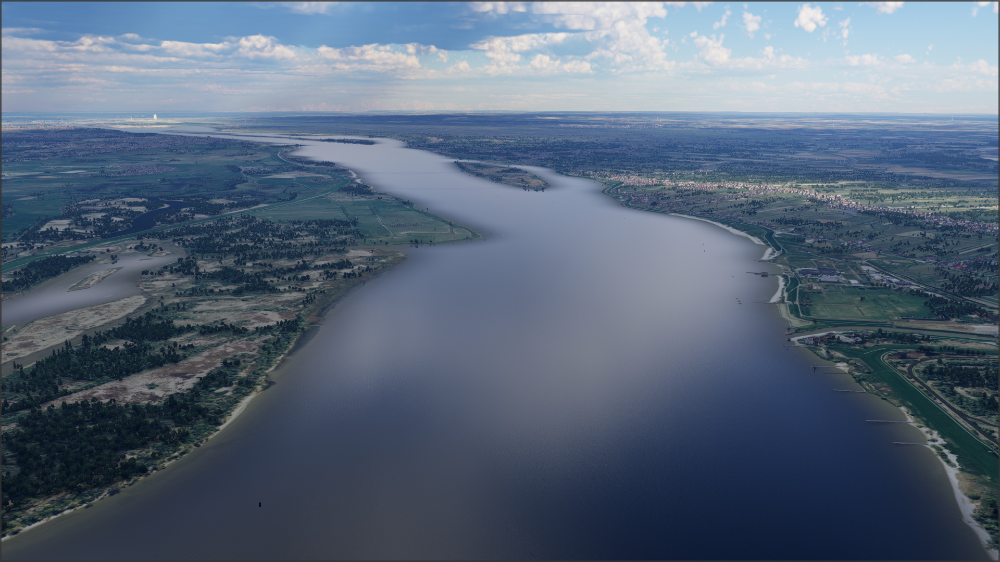
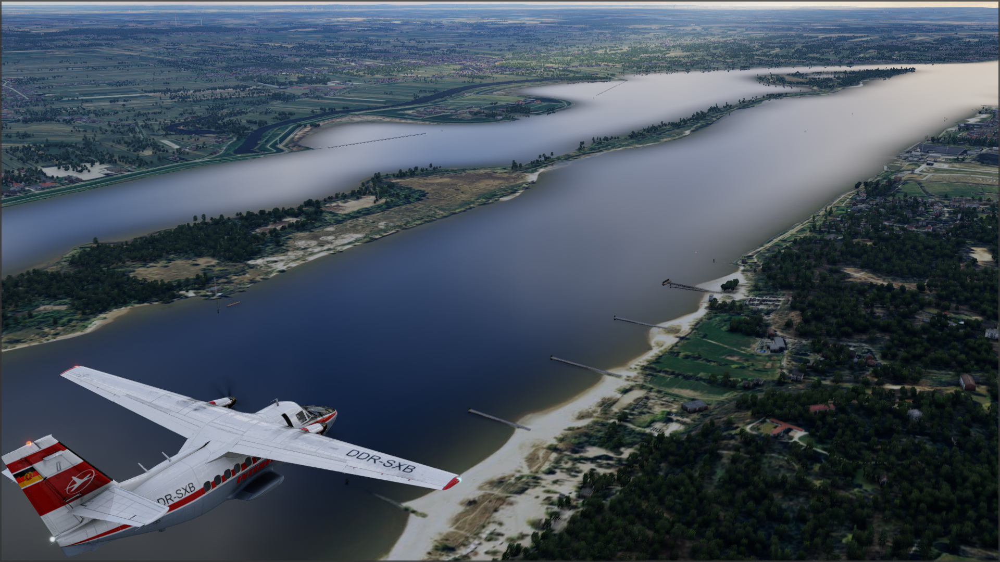
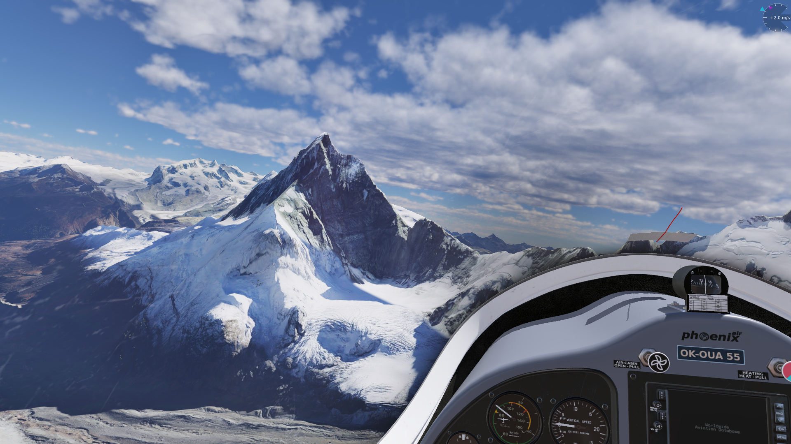
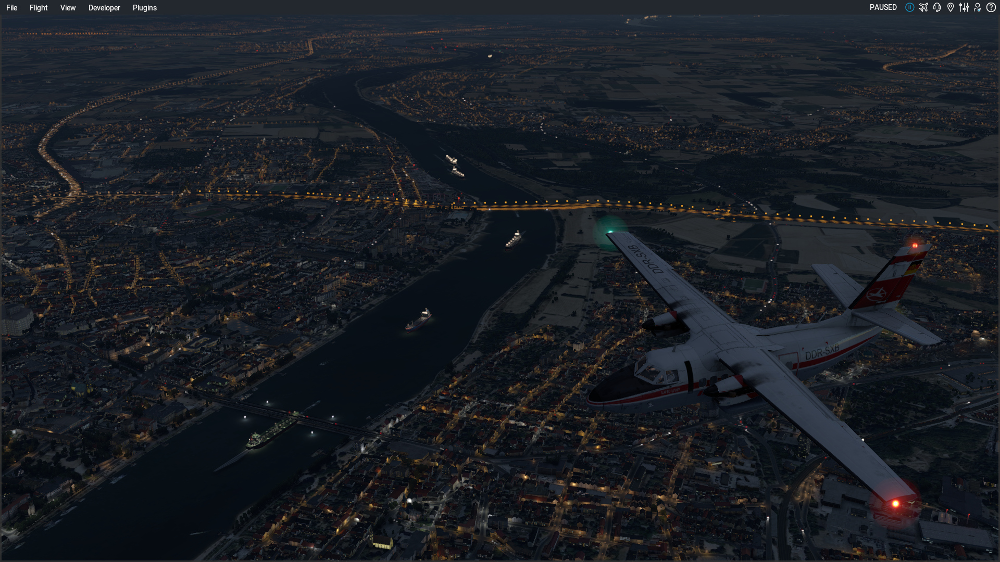
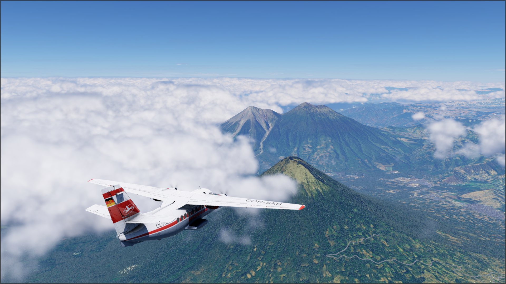
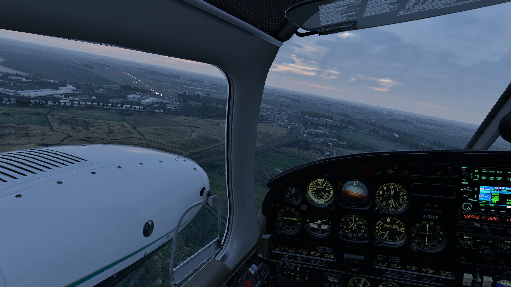

# autoortho-scenery (flightwusel packages)

Prepared X-Plane scenery packs for the AutoOrtho project.

This is a fork of the original autoortho-scenery that Matt created.
It contains the generated autoortho-scenery packages as releases and the source code for the build system.
Its main intention is to provide packages compatible with X-Plane 12.

NOTE: These scenery packs contain no textures and require
[AutoOrtho](https://github.com/kubilus1/autoortho) to work.

# The Scenery

* is an X-Plane 12 base mesh scenery with high resolution elevation data (where available) and bathymetry.

* does not contain overlays (roads, forests, houses)! We recommend to use simHeaven X-WORLD (or X-WORLD PRO).

# Download

These are the scenery packages:

Download via BitTorrent. .torrent files are [under each release](https://github.com/jonaseberle/autoortho-scenery/releases)

# Installation

You should know your way around AutoOrtho's mode of operation.
When you are unsure, please read 
[this forum post](https://forums.x-plane.org/forums/topic/303551-when-you-have-a-problem-with-autoortho-%E2%80%93-please-read/).

See the [tile README.txt](README.txt.template) inside each downloaded package for installation instructions, information about used 
elevation data, used software and known issues.

I cannot be held responsible for any problems.

# Changelog

See the release descriptions under [releases](https://github.com/jonaseberle/autoortho-scenery/releases).

# Issues

Check if there are open [issues here](https://github.com/jonaseberle/autoortho-scenery/issues), help solving them if you can.

Open a new issue (requires a Github-login) or post to the [forum thread](https://forums.x-plane.org/forums/topic/346802-autoortho-scenery-flightwusel-packages-for-x-plane-12-as-torrent-downloads/).

# Screenshots

## v1.4

# Todo (maybe...):

Implement many useful O4XP patches by November Lima: https://forums.x-plane.org/profile/5997-november-lima/content/?type=downloads_file
