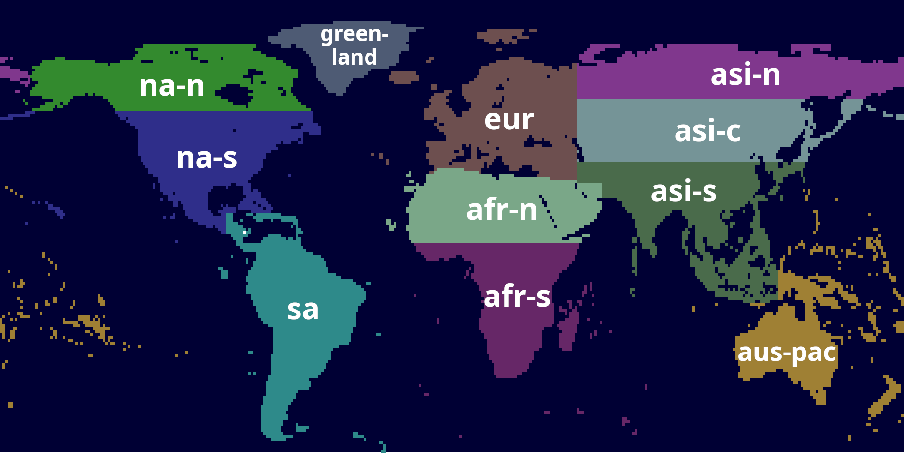

# autoortho-scenery (flightwusel packages)
Prepared X-Plane scenery packs for the AutoOrtho project.

This is a fork of the original autoortho-scenery that Matt created. 
Its main intention is to provide packages compatible with X-Plane 12.

NOTE: This scenery pack contains no textures and requires [AutoOrtho](https://github.com/kubilus1/autoortho) to work.
Without this tool running this scenery pack will not function as intended.

It does not contain overlays. We recommend simHeaven X-WORLD to use with it.

# Download

Download via BitTorrent. .torrent files are [here](https://c.boolshit.ovh/s/ty5mBbzyRZPDKFM)

# Installation

This does not use the AutoOrtho installer. You need to install it manually.
You can/should remove the original scenery packages downloaded via the AutoOrtho installer.
It could be that the installer does not work with it afterwards.

I cannot be held responsible for any problems. 

You should now your way around AutoOrtho's mode of operation.
When you are unsure, please read [this forum post](https://forums.x-plane.org/forums/topic/303551-when-you-have-a-problem-with-autoortho-%E2%80%93-please-read/).

See the [README.txt](README.txt.template) inside each downloaded package for installation instructions.
